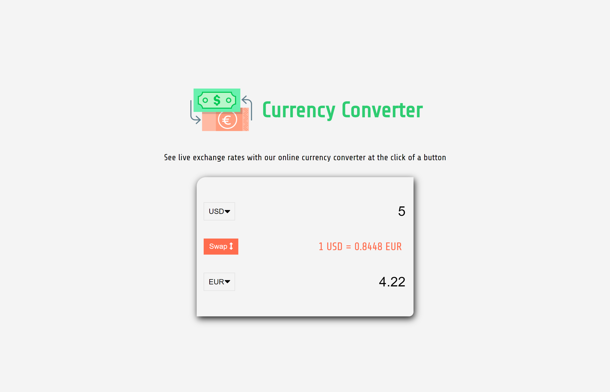
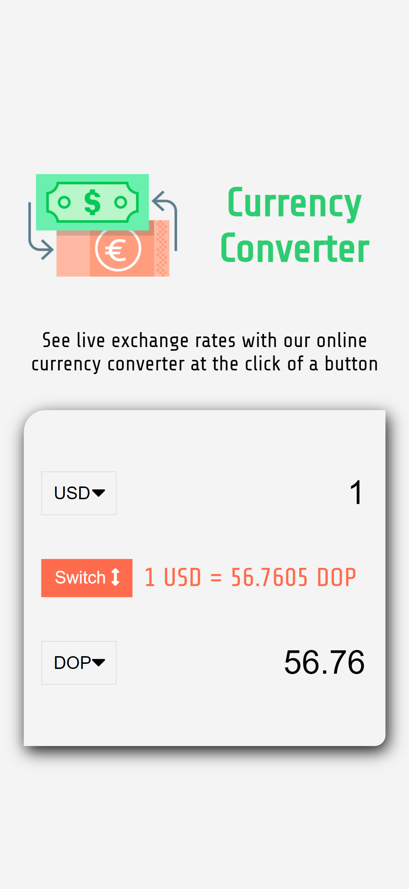

# Currency converter
 
- Exchange rate calculator web app, using fetch api to make a http request to a third party api and put it into the DOM.
- You can select a currency, change value and swap the currency.

